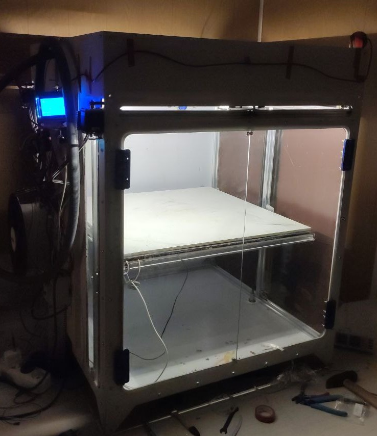

= Komrade of Maker (universal CNC platform)

[.right]
.First prototype, build volume (mm) 580x580x580

This design is universal platform, that uses where available affordable parts, primarily from Reprap project, 8 bit realtime controllers, RPi 3/4 and Klipper.

Primary characteristics by application:

* 3D printing:
** Enclosed chamber passively heated up to 80ºC;
** Filament motion control;
** Auto bed levelling with Piezo Sensor and triple z axis;
** X/Y Linear speeds up to 200 mm/s (or greater with proper voltage/servos);
** Ceramic build surface.
* Milling with 585 series motors:
** Soft materials, e.g.: sheet plastics, plywood, aluminium (not tested);
** PCB prototyping.
* Laser cutting/engraving.
* Electrochemical machining.

== BOM
=== Base vitamins

.Base components common for all models
[cols="5,1,1,1",options="header",]
|===
|Part |Amount |Aliexpress |Amazon
|RAMPS 1.6+ |1 | - |-
|Arduino Mega |1 | - | -
|HDMI LCD 7" |1 | - | -
|RPi 3/4 |1 | - | -
|RPi Camera |1 | - | -
|RPi Motor Shield |1 | - | -
|Nema 17 steppers |5 | - | -
|X/Y axis MKS-Servo 42C |2 | - | -
|TMC 2209 |4 | - | -
|D16T parts set for universal X caret |1 | - | -
|V Slot Wheels|23 | - | -
|Steel parts for Z axis mount |1 | - | -
|Z axis axial bearing | 3 | - | -
|Z axis flexible coupler 5*8 |3 | - | -
|steel ball ø8mm |3 | - | -
|===

.Orbiter Extruder 3D Printer Toolhead
[cols="5,1,1,1",options="header",]
|===
|Part |Amount |Aliexpress |Amazon
|Extruder Orbiter with LDO stepper |1 | - | -
|Filament motion sensor |1 | - | -
|Crazy NF hotend | 1 | - | -
|===

=== Model KМ—3

Build Volume (mm): 300x300x300

[cols=",,,",options="header",]
|===
|Part |Amount |Aliexpress |Amazon
|  leadscrew  350 mm|  3  |  - | -
|  2020 VSlot extrusion 450 mm | 12 | - | -
|  2020 VSlot extrusion 850 mm | 4 | - | -
|  2040 VSlot extrusion 450 mm | 2 | - | -
|  GT6 Gates Belt (m) |  3  |  - | -
|===

=== Model KМ—6

Build Volume (mm): 600x600x600

== Dependencies

https://github.com/nophead/NopSCADlib
https://github.com/openscad/scad-utils
https://github.com/oysteinkrog/thing_libutils
https://github.com/Obijuan/obiscad

